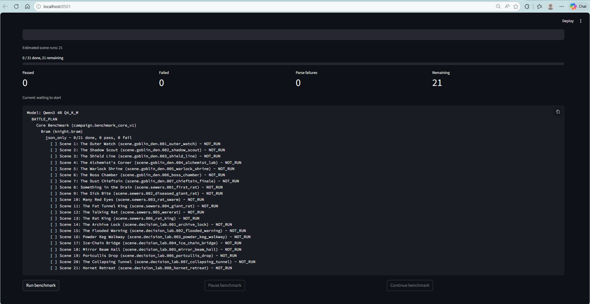
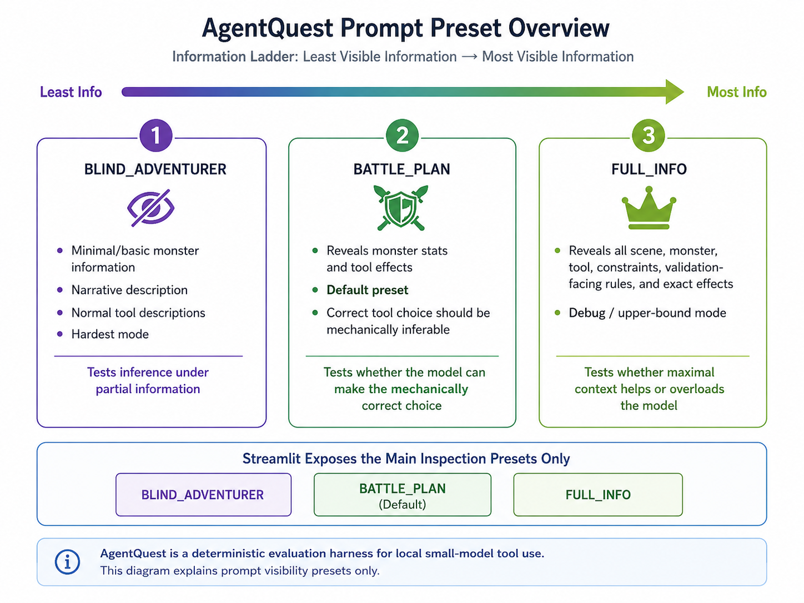

# AgentQuest

AgentQuest is a small-model tool-calling testbed wrapped in a playable RPG. It asks local LLMs to read a scene, reason over limited or implicit information, and choose one valid structured action:

```json
{"tool_id": "...", "arguments": {...}}
```

The RPG layer gives the evaluation concrete pressure: characters have different tools, scenes hide or reveal different facts, prompt presets gate knowledge, and campaign retries can carry notes forward into future attempts. The goal is to inspect whether small models can follow the interface, choose legal actions, use available context, and improve when given run history.

The engine validates each response in three stages:

1. AST validation: is the JSON well-formed and schema-correct?
2. Hard validation: can this character legally use that tool here?
3. Soft validation: does the action solve the scene?

## Visual Overview

Benchmark mode runs repeatable model, prompt-preset, campaign, and character sweeps while keeping scene-level outcomes visible.



The prompt presets form an information ladder for testing how much context helps or overloads smaller local models.



See the [portfolio materials](docs/portfolio.md) and [full screenshot catalog](docs/portfolio_assets/README.md) for additional examples.

## Quick Start

Install the project from the repository root:

```bash
pip install -e .
```

AgentQuest uses Python 3.11 or newer. For model-backed runs, install the llama.cpp backend:

```bash
pip install llama-cpp-python
```

Launch the Streamlit UI:

```bash
streamlit run streamlit_app.py
```

Streamlit is the easiest way to use the project. It opens on Benchmark mode for repeatable model, preset, campaign, and character sweeps. Use Inspect Run to drill into one campaign or scene with a model actor or human player and inspect the prompt, raw output, parsed tool call, validation result, retries, notes, and saved run logs.

Model aliases are defined in `configs/model_catalog.json`. To test another model, add it there and restart Streamlit. If the model is hosted behind Hugging Face access controls, set `HF_TOKEN` in your environment or a local `.env` file.

Run the test suite:

```bash
pytest
```

## Common Commands

The command line tools are useful for repeatable experiments, saved artifacts, and automation.

Preview the exact prompt messages without calling a model:

```bash
python -m src.runner.preview_prompt --preset BATTLE_PLAN
python -m src.runner.preview_prompt --character-id knight.bram --scene-id scene.goblin_den.001_outer_watch
python -m src.runner.preview_prompt --save-json runs/prompt_preview.json
```

Run one scene:

```bash
python -m src.runner.run_one --character-id knight.bram --scene-id scene.goblin_den.001_outer_watch
```

Run one campaign:

```bash
python -m src.runner.run_campaign --campaign-id campaign.goblin_den_v1 --character-id knight.bram
python -m src.runner.run_campaign --campaign-id campaign.goblin_den_v1 --character-id knight.bram --continue-on-failure
python -m src.runner.run_campaign --campaign-id campaign.goblin_den_v1 --character-id knight.bram --self-learning --per-scene-retry-limit 3 --total-retry-limit 20
```

Run a benchmark sweep:

```bash
python scripts/run_benchmark.py --campaign-id campaign.benchmark_core_v1 --all-characters --preset BATTLE_PLAN --prompt-format json_only --model qwen3_4b_q4_k_m
```

Generate a deterministic validation report:

```bash
python scripts/generate_validation_report.py
```

## Streamlit UI

The Streamlit app exposes the main evaluation and inspection workflows:

- benchmark-first landing page for repeatable sweeps
- catalog model and human-player selection
- prompt presets: `BLIND_ADVENTURER`, `BATTLE_PLAN`, and `FULL_INFO`
- single-scene and campaign inspection modes
- self-learning campaign retries with notes
- raw output, parsed tool call, prompt, validation, and retry inspection
- saved run logs for scene and campaign runs

## Documentation

- Architecture: [`docs/architecture.md`](docs/architecture.md)
- Local development: [`docs/development.md`](docs/development.md)
- Testing: [`docs/testing.md`](docs/testing.md)
- Models: [`docs/models.md`](docs/models.md)
- Custom AgentQuest data: [`docs/custom_data.md`](docs/custom_data.md)
- Prompt system: [`src/prompts/README.md`](src/prompts/README.md)
- Engine and validators: [`src/engine/README.md`](src/engine/README.md)
- Open5e data pipeline: [`src/data_pipeline/README.md`](src/data_pipeline/README.md)
- Portfolio materials: [`docs/portfolio.md`](docs/portfolio.md)

## Project Layout

```text
agentquest/
|-- configs/
|-- data/
|-- docs/
|-- scripts/
|-- src/
|   |-- app/
|   |-- data_pipeline/
|   |-- engine/
|   |-- models/
|   |-- prompts/
|   `-- runner/
|-- tests/
|-- main.py
`-- streamlit_app.py
```

Generated outputs such as run logs, caches, local models, and generated Open5e data are intentionally kept out of the main documentation path.
